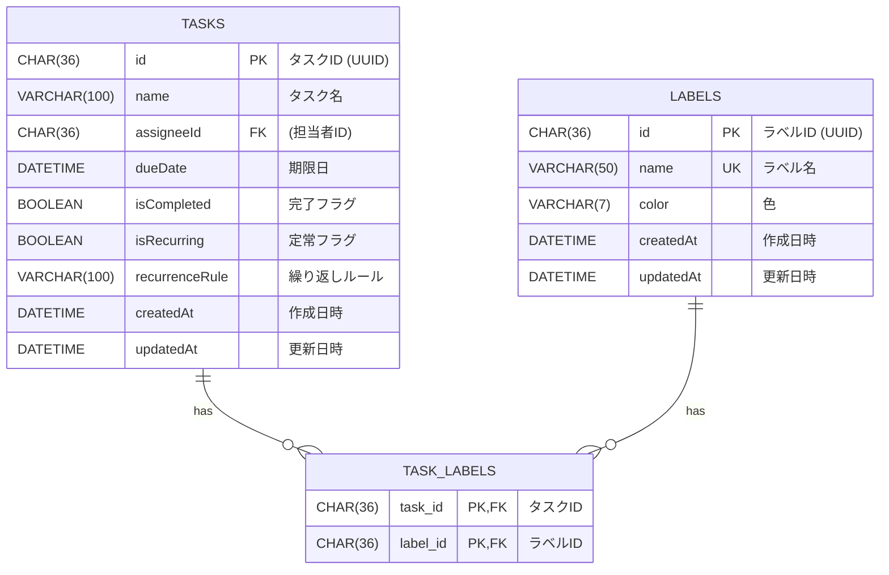

```mermaid
erDiagram
TASKS ||--o{ TASK_LABELS : "has"
LABELS ||--o{ TASK_LABELS : "has"

    TASKS {
        CHAR(36) id PK "タスクID (UUID)"
        VARCHAR(100) name "タスク名"
        CHAR(36) assigneeId FK "(担当者ID)"
        DATETIME dueDate "期限日"
        BOOLEAN isCompleted "完了フラグ"
        BOOLEAN isRecurring "定常フラグ"
        VARCHAR(100) recurrenceRule "繰り返しルール"
        DATETIME createdAt "作成日時"
        DATETIME updatedAt "更新日時"
    }

    LABELS {
        CHAR(36) id PK "ラベルID (UUID)"
        VARCHAR(50) name UK "ラベル名"
        VARCHAR(7) color "色"
        DATETIME createdAt "作成日時"
        DATETIME updatedAt "更新日時"
    }

    TASK_LABELS {
        CHAR(36) task_id PK, FK "タスクID"
        CHAR(36) label_id PK, FK "ラベルID"
    }

```
